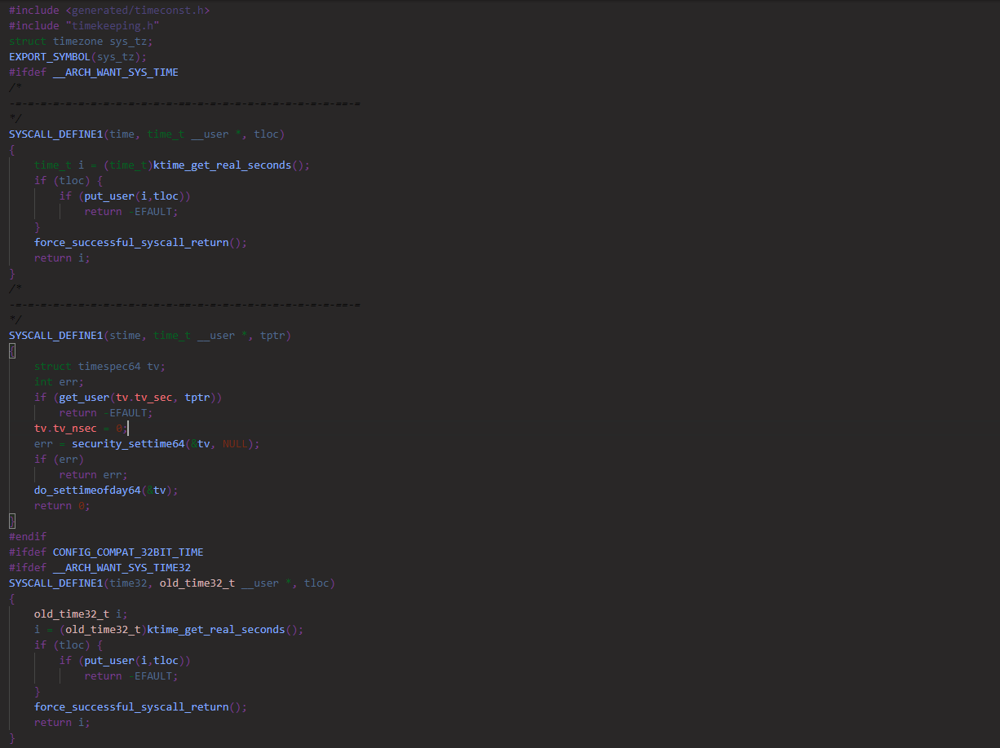
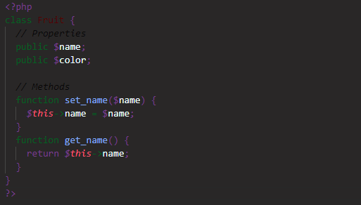

<div align="center">
      
</div>

# 🌙 Dark mode theme for [Visual Studio Code](https://code.visualstudio.com)
Pretty dark theme for you that doesn't want eye pain anymore

if you like the theme don't forget to follow me on [Github](https://github.com/synterrr).

# 📷 ScreenShots





# 📌 Reason for making the theme
I really can't code in themes that are too light or not the way i want them to be, so i made this theme to have one where 
it will not hurt my eyes

# 💻  Manual Installation

```
cd darkmode-theme
npm install

```

After that if you would like to play around with new colors, feel free to fork it and edit the colors in the monokai-dark-green.yml.
Once you feel like testing it, just run the script build with:

```
npm run package
```

**Enjoy!**
